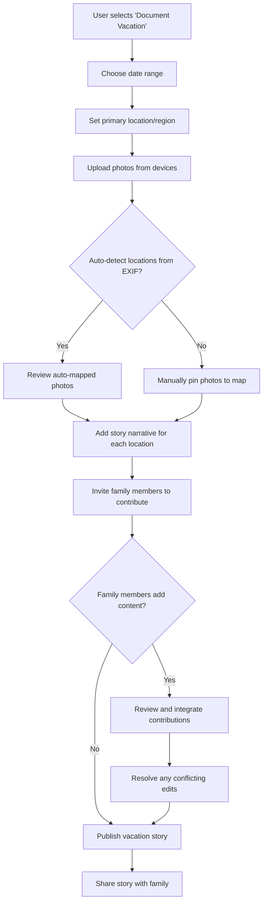
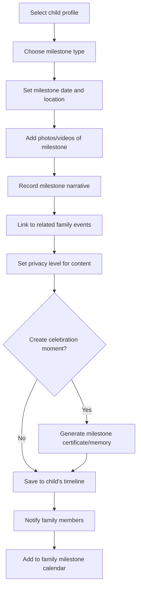
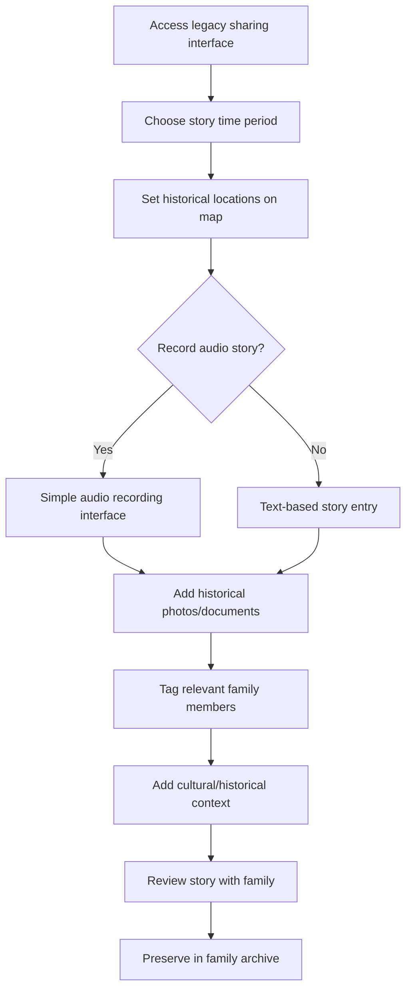

# Our Line in Time UI/UX Specification

This document defines the user experience goals, information architecture, user flows, and visual design specifications for Our Line in Time's user interface. It serves as the foundation for visual design and frontend development, ensuring a cohesive and user-centered experience.

## Overall UX Goals & Principles

### Target User Personas

**Primary Family Storyteller (Parent/Guardian):**
- Age 30-50, managing family memories and events
- Values privacy, ease of use, and rich storytelling capabilities
- Needs efficient content creation with multimedia support

**Legacy Keeper (Grandparent/Elder):**
- Age 60+, sharing historical family stories and wisdom
- Requires simple, accessible interfaces with audio recording focus
- Values preserving heritage for future generations

**Young Contributor (Teen/Young Adult):**
- Age 13-25, adding personal perspectives to family narratives
- Expects mobile-first design with social sharing features
- Needs privacy controls and creative expression tools

**Family Historian/Curator:**
- Any age, passionate about genealogy and family documentation
- Requires advanced organizational tools and data management
- Values accuracy, comprehensive search, and cross-referencing

### Usability Goals

- **Intuitive Multi-Generation Design:** Interfaces that work for ages 8 to 80+
- **Memory Preservation Confidence:** Users feel secure their precious content is safe
- **Effortless Storytelling:** Adding memories feels natural, not like data entry
- **Collaborative Harmony:** Multiple family members contribute without conflicts
- **Privacy by Design:** Granular control over who sees what content

### Design Principles

1. **Memories First, Technology Second** - The interface disappears so stories shine
2. **Respect Every Generation** - Design adapts to different ages and tech comfort levels
3. **Stories Connect Places and Time** - Seamlessly weave geographic and temporal context
4. **Family Privacy is Sacred** - Never compromise on data security and access control
5. **Simplicity Scales to Complexity** - Start simple but support rich, detailed storytelling

### Change Log

| Date | Version | Description | Author |
|------|---------|-------------|--------|
| 2025-09-13 | 1.0 | Initial specification creation | Sally (UX Expert) |
| 2025-09-15 | 1.1 | Updated with actual implementation details | Updated by Claude Code |

## Information Architecture (IA)

### Site Map / Screen Inventory

```mermaid
graph TD
    A[Home Dashboard] --> B[Timeline Explorer]
    A --> C[FamilyAtlas Map]
    A --> D[Family Tree]
    A --> E[Memory Collection]
    A --> F[Family Settings]

    B --> B1[Personal Timeline]
    B --> B2[Family Timeline]
    B --> B3[Milestone View]
    B --> B4[Era Browser]

    C --> C1[Location Stories]
    C --> C2[Migration Routes]
    C --> C3[Historical Overlays]
    C --> C4[Memory Clusters]

    D --> D1[Member Profiles]
    D --> D2[Relationships]
    D --> D3[Generational View]
    D --> D4[Legacy Handoffs]

    E --> E1[Photo Galleries]
    E --> E2[Audio Stories]
    E --> E3[Video Memories]
    E --> E4[Documents]
    E --> E5[Search & Filter]

    F --> F1[Privacy Controls]
    F --> F2[Collaboration Permissions]
    F --> F3[Backup & Export]
    F --> F4[Account Management]

    B1 --> B1a[Add Memory]
    B2 --> B2a[Collaborative Editor]
    C1 --> C1a[Location Memory Editor]
    E1 --> E1a[Photo Upload & Tagging]
```

### Navigation Structure

**Primary Navigation:** Tab-based navigation with Timeline, Map, Family, Collection, and Settings as core areas. The design emphasizes the unique temporal+geographic duality through prominent Timeline and Map access.

**Secondary Navigation:** Context-aware sidebar navigation that adapts based on current view. In Timeline mode, shows date filters and person filters. In Map mode, shows location filters and historical layers. In Family mode, shows generational navigation.

**Breadcrumb Strategy:** Hierarchical breadcrumbs that show temporal and spatial context simultaneously. Example: "Family > Smith Timeline > 1995 Summer > California Vacation > San Francisco > Golden Gate Photos"

## User Flows

### Family Vacation Documentation Flow

**User Goal:** Create a rich geographic story of family vacation with multiple perspectives and locations

**Entry Points:** Dashboard "Add Memory" button, Map "Add Location Story", Timeline "Add Event"

**Success Criteria:** Complete vacation story with mapped locations, photos, narratives, and family member contributions

#### Flow Diagram

#### Edge Cases & Error Handling:
- **No location data in photos:** Provide intuitive map interface for manual location tagging
- **Conflicting family member edits:** Show diff view with one-click merge options
- **Large photo uploads:** Progressive upload with background processing and preview generation
- **Offline story creation:** Queue edits locally with sync notification when reconnected
- **Privacy concerns:** Granular sharing controls before publication

**Notes:** This flow emphasizes the seamless integration of geographic and temporal data while supporting collaborative family storytelling.

### Child Milestone Tracking Flow

**User Goal:** Document child's important milestones with temporal and geographic context for long-term family memory

**Entry Points:** Child profile page, Timeline milestone markers, Dashboard quick actions

**Success Criteria:** Milestone recorded with growth context, location significance, and family celebration

#### Flow Diagram

#### Edge Cases & Error Handling:
- **Approximate dates:** Flexible date picker supporting "around", "summer of", "age 2" formats
- **Missing location context:** Suggest locations based on family history and timeline
- **Sensitive content:** Enhanced privacy controls for child-specific content
- **Future milestone planning:** Template system for anticipated milestones

**Notes:** Child-focused flow emphasizes privacy, growth visualization, and integration with broader family context.

### Grandparent Legacy Sharing Flow

**User Goal:** Easily share historical family stories with audio recording and geographic context

**Entry Points:** Family Tree legacy section, Audio recording widget, Historical timeline

**Success Criteria:** Rich historical story preserved with audio, photos, and geographic context for future generations

#### Flow Diagram

#### Edge Cases & Error Handling:
- **Audio quality issues:** Auto noise reduction and recording tips
- **Historical location uncertainty:** Flexible geographic boundaries and "approximate area" options
- **Complex family relationships:** Visual relationship mapping tool
- **Technology comfort:** Large buttons, clear instructions, undo/redo throughout

**Notes:** Designed for accessibility and simplicity while preserving rich historical context.

## Wireframes & Mockups

**Primary Design Files:** Design files should be created in Figma or similar collaborative design tool, with organized component libraries and clear handoff specifications for developers.

### Key Screen Layouts

#### Dashboard Home Screen

**Purpose:** Central hub that immediately showcases recent family activity and provides intuitive access to all major features

**Key Elements:**
- Recent Family Activity feed with temporal and geographic context
- Quick access buttons for "Add Memory", "Explore Timeline", "View Map"
- Family member status indicators showing who's been active
- Upcoming milestones and anniversaries
- Search bar with smart suggestions based on family data

**Interaction Notes:** Dashboard adapts to user's role (parent/child/grandparent) with appropriate content prioritization. Drag-and-drop functionality for quick memory uploads.

**Current Implementation Status:** Dashboard layout implemented with Next.js App Router. Authentication flow complete with login/register forms.

**Design File Reference:** [To be created in Figma: Dashboard wireframes and interactive prototype]

#### Timeline Explorer Interface

**Purpose:** Primary interface for temporal storytelling with seamless geographic integration

**Key Elements:**
- Interactive timeline with zoomable date ranges (decade to day view)
- Memory cards with preview thumbnails and geographic indicators
- Filter panel for people, locations, and event types
- Timeline scrubber with milestone markers
- "Add Memory" overlay that maintains timeline context

**Interaction Notes:** Timeline supports both linear scrolling and jump-to-date functionality. Memory cards expand inline for quick preview without losing timeline position.

**Current Implementation Status:** Timeline component implemented with React and TypeScript. Foundation in place for temporal navigation.

**Design File Reference:** [To be created in Figma: Timeline interface with responsive variants]

#### FamilyAtlas Map View

**Purpose:** Geographic storytelling interface that shows family memories across places and time

**Key Elements:**
- Interactive map with memory location clusters
- Temporal slider to show how family geography changes over time
- Memory preview panels triggered by map pin interactions
- Historical map overlay toggle for legacy stories
- Location-based story creation tools

**Interaction Notes:** Map and timeline views maintain synchronized state - selecting a memory in timeline highlights its location on map and vice versa.

**Current Implementation Status:** Leaflet and React-Leaflet dependencies installed for map functionality. Geographic mapping features ready for implementation.

**Design File Reference:** [To be created in Figma: Map interface with interaction states and mobile adaptations]

## Component Library / Design System

**Design System Approach:** Built on Radix UI primitives with Tailwind CSS for styling, following accessibility-first principles. The current implementation includes foundational components with component variants optimized for different user personas (child-friendly, elder-accessible, power-user efficient). The design system prioritizes consistency across temporal and geographic interfaces while maintaining the unique storytelling focus.

**Current Implementation Status:**
- **UI Foundation**: Radix UI components with Tailwind CSS styling
- **Component Architecture**: Shared UI components in `@our-line-in-time/ui` package
- **Form Components**: LoginForm and RegisterForm with Lucide React icons
- **Upload Components**: MediaUpload component with drag-and-drop functionality
- **Timeline Components**: Timeline component for temporal storytelling
- **Testing Infrastructure**: Vitest + Testing Library setup for component testing

### Core Components

#### Memory Card Component

**Purpose:** Flexible container for displaying family memories across timeline, map, and gallery contexts

**Variants:**
- **Timeline Card:** Emphasizes date, location pin, and story preview
- **Map Card:** Compact preview triggered by location pins
- **Gallery Card:** Photo-focused with metadata overlay
- **Child Mode:** Larger touch targets, simpler information hierarchy

**States:** Default, hover, selected, editing, loading, offline

**Usage Guidelines:** Always include temporal and geographic context when available. Support progressive disclosure - start with essential info, expand for details. Maintain consistent action patterns across all variants.

#### Location Picker Component

**Purpose:** Unified interface for selecting and managing geographic information across all family memory contexts

**Variants:**
- **Map Picker:** Interactive map with search and pin placement
- **Text Picker:** Address autocomplete with geographic validation
- **Historical Picker:** Period-appropriate location selection with historical boundaries
- **Approximate Picker:** "Around here" selection for uncertain locations

**States:** Empty, searching, selected, historical, approximate, error

**Usage Guidelines:** Default to current location with privacy controls. Support both precise and approximate location selection. Include historical context when relevant.

#### Timeline Navigator Component

**Purpose:** Primary navigation for temporal exploration with integrated geographic awareness

**Variants:**
- **Decade View:** High-level family era navigation
- **Year View:** Annual family activity overview
- **Month View:** Detailed timeline with events
- **Day View:** Hour-by-hour memory documentation

**States:** Loading, navigating, filtered, collaborative-editing, milestone-focused

**Usage Guidelines:** Maintain smooth transitions between time scales. Show geographic context at all zoom levels. Support keyboard navigation for accessibility.

#### Family Member Selector Component

**Purpose:** Handle complex family relationships and permissions across multi-generational content

**Variants:**
- **Single Selector:** Choose one family member for tagging/permissions
- **Multi Selector:** Select multiple family members for collaborative content
- **Generational View:** Family tree-based selection interface
- **Privacy Aware:** Show only members with appropriate access levels

**States:** Collapsed, expanded, searching, restricted, guest-mode

**Usage Guidelines:** Respect privacy levels and age-appropriate access. Support both relationship-based and name-based selection. Include visual relationship indicators.

## Branding & Style Guide

**Brand Guidelines:** As an open-source family memory platform, the brand should feel welcoming to all generations while maintaining credibility for long-term family data preservation. Visual language should emphasize connection, heritage, and the passage of time.

### Color Palette

| Color Type | Hex Code | Usage |
|------------|----------|--------|
| Primary | #2D5A87 | Deep blue representing trust, stability, and timeless quality |
| Secondary | #C4951F | Warm gold for highlights, achievements, and special moments |
| Accent | #7B9E89 | Sage green for geographic elements, growth, and nature |
| Success | #4A7C59 | Forest green for confirmations, completed milestones |
| Warning | #D49C3D | Warm amber for important notices, pending actions |
| Error | #B85450 | Muted red for errors, avoiding harsh alarm tones |
| Neutral | #F8F9FA, #E9ECEF, #495057, #212529 | Light to dark grays for text, borders, backgrounds |

### Typography

#### Font Families
- **Primary:** System font stack (optimized for performance and cross-platform consistency)
- **Secondary:** Source Serif Pro (for storytelling content and historical contexts) - *To be implemented*
- **Monospace:** System monospace stack (for technical information and data)

#### Type Scale

| Element | Size | Weight | Line Height |
|---------|------|--------|-------------|
| H1 | 2.5rem | 700 | 1.2 |
| H2 | 2rem | 600 | 1.3 |
| H3 | 1.5rem | 600 | 1.4 |
| Body | 1rem | 400 | 1.6 |
| Small | 0.875rem | 400 | 1.5 |

### Iconography

**Icon Library:** Lucide React for consistent, accessible iconography with clear family-relevant symbols

**Current Implementation:** Using Lucide React icons including Eye, EyeOff, Loader2 for authentication forms

**Usage Guidelines:** Icons should always be accompanied by text labels for accessibility. Use outline style for navigation, filled style for active states. Maintain consistent sizing across related icon groups.

### Spacing & Layout

**Grid System:** 12-column responsive grid with 24px gutter, adapting to 8px base spacing system

**Spacing Scale:** 4px, 8px, 16px, 24px, 32px, 48px, 64px, 96px - following 8px baseline for consistent rhythm

## Accessibility Requirements

### Compliance Target

**Standard:** WCAG 2.1 Level AA compliance, with selective Level AAA features for critical family memory interactions

### Key Requirements

**Visual:**
- Color contrast ratios: Minimum 4.5:1 for normal text, 3:1 for large text, with enhanced 7:1 ratios for critical actions
- Focus indicators: 2px solid outline with high contrast, visible on all interactive elements
- Text sizing: Support up to 200% zoom without horizontal scrolling, with large text options in settings

**Interaction:**
- Keyboard navigation: Full functionality accessible via keyboard with logical tab order and skip links
- Screen reader support: Comprehensive ARIA labels, live regions for dynamic content, semantic HTML structure
- Touch targets: Minimum 44px clickable area, with larger targets (60px+) for primary actions

**Content:**
- Alternative text: Descriptive alt text for all images, with special consideration for family photos and memories
- Heading structure: Logical H1-H6 hierarchy that reflects content organization and family relationships
- Form labels: Clear, descriptive labels for all form controls with error messaging and validation guidance

### Testing Strategy

Regular accessibility audits using automated tools (axe-core, Lighthouse) combined with manual testing with actual screen readers and assistive technologies. Usability testing with older adults and users with disabilities throughout the design process, not just at the end.

## Responsiveness Strategy

### Breakpoints

| Breakpoint | Min Width | Max Width | Target Devices |
|------------|-----------|-----------|----------------|
| Mobile | 320px | 767px | Smartphones, memory capture on-the-go |
| Tablet | 768px | 1023px | iPads, Android tablets, storytelling interfaces |
| Desktop | 1024px | 1439px | Laptops, home computers, detailed editing |
| Wide | 1440px | - | Large monitors, power user interfaces, collaborative editing |

### Adaptation Patterns

**Layout Changes:** Mobile-first progressive enhancement - Timeline becomes vertical scroll, Map interface adapts to full-screen with overlay controls, Family tree transforms to expandable sections

**Navigation Changes:** Mobile uses bottom tab navigation with contextual top bars, Tablet introduces sidebar navigation, Desktop supports persistent sidebar with expanded functionality

**Content Priority:** Mobile prioritizes recent memories and quick actions, Tablet balances exploration with creation, Desktop supports advanced filtering and multi-panel views

**Interaction Changes:** Mobile emphasizes touch with gesture navigation, Tablet supports both touch and precision pointer, Desktop adds keyboard shortcuts and advanced editing capabilities

## Animation & Micro-interactions

### Motion Principles

**Purposeful & Emotional:** Every animation serves a clear functional purpose while honoring the emotional significance of family memories. Transitions between timeline periods should feel like gentle page turns through a family album, not jarring digital jumps.

**Respectful of All Ages:** Motion design accommodates users from children to elderly adults - animations are never too fast, too subtle, or overwhelming. Provide motion reduction options for users with vestibular disorders.

**Geographic & Temporal Awareness:** Animations reinforce the connection between time and place - timeline transitions include subtle geographic context, map movements maintain temporal awareness.

### Key Animations

- **Memory Reveal Animation:** Gentle fade-up with subtle scale (Duration: 300ms, Easing: ease-out)
- **Timeline Navigation:** Smooth horizontal slide with momentum scrolling (Duration: 400ms, Easing: cubic-bezier(0.25, 0.46, 0.45, 0.94))
- **Map Transition:** Coordinated zoom and pan with timeline synchronization (Duration: 600ms, Easing: ease-in-out)
- **Photo Gallery Expansion:** Elegant modal growth from thumbnail position (Duration: 250ms, Easing: ease-out)
- **Family Member Addition:** Celebratory bounce for new family contributions (Duration: 500ms, Easing: bounce)
- **Collaborative Editing Indicators:** Subtle pulse for real-time activity (Duration: 2000ms, Easing: ease-in-out, infinite)
- **Memory Completion:** Satisfying completion animation for milestone achievements (Duration: 800ms, Easing: ease-out)

## Performance Considerations

### Performance Goals

- **Page Load:** Initial dashboard loads in under 2 seconds on 3G connections
- **Interaction Response:** All UI interactions respond within 100ms, with visual feedback for longer operations
- **Animation FPS:** Maintain 60fps for all animations, gracefully degrade on older devices

**Current Implementation:**
- Next.js 15 with App Router for optimized performance
- Tailwind CSS for minimal CSS bundle size
- Zustand for lightweight state management
- React 19 for improved rendering performance

### Design Strategies

**Progressive Content Loading:** Timeline and map interfaces load essential content first (recent memories, current location), then progressively enhance with historical data. Use skeleton screens and lazy loading for photos and videos.

**Intelligent Caching:** Cache frequently accessed family memories locally with smart preloading based on usage patterns. Prioritize recent uploads and upcoming anniversaries/milestones.

**Responsive Media Delivery:** Serve appropriately sized images for device capabilities and connection speed. Generate multiple sizes during upload for optimal delivery across mobile, tablet, and desktop contexts.

**Collaborative Efficiency:** Real-time collaborative features use minimal bandwidth through efficient diff-based synchronization and smart conflict resolution that doesn't require constant server communication.
